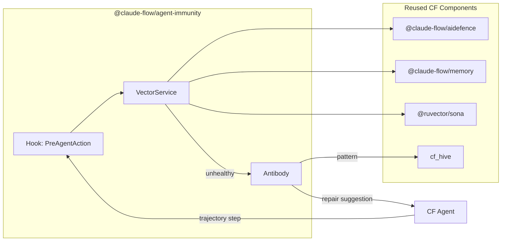

# ADR-001: Agent Immunity Plugin for Claude-Flow

**Status**: Proposed  
**Date**: 2026-02-01  
**Author**: JLMA Agentic AI Team  

---

## TL;DR

A lightweight (~500 LOC) plugin that intercepts agent actions, analyzes against health vectors, and suggests repairs—**100% reusing existing CF infrastructure**.

---

## Problem

**Agentic Drift**: Autonomous agents may:
- Violate coding standards (Doctrine)
- Introduce security vulnerabilities
- Hallucinate non-existent APIs/paths
- Lose coherence (big refactor when asked for "fix typo")
- Enter infinite loops burning tokens

Current defenses are **reactive** (post-commit CI). AIS is **proactive** (pre-commit interception).

---

## Decision

Implement `@claude-flow/agent-immunity` as a **lightweight CF plugin** (~500 LOC).

### What We Reuse (Zero Reinvention)

| Component | CF Package | Usage |
|:----------|:-----------|:------|
| **Hooks** | `@claude-flow/hooks` | `PreAgentAction`, `PostAgentAction` events |
| **Security Analysis** | `@claude-flow/aidefence` | ThreatDetector, PII scanner, 50+ patterns |
| **Truth Check** | `@claude-flow/memory` | HNSW embeddings for hallucination detection |
| **Learning** | `AgenticFlowBridge` | ReasoningBank pattern storage |
| **Fleet Broadcast** | `@claude-flow/swarm` | `cf_hive` for immunity pattern sharing |
| **Semantic Embeddings** | `@ruvector/sona` | Intent vs Code coherence |

### What We Build (~550 LOC new code)

| File | LOC | Description |
|:-----|:----|:------------|
| `plugin.ts` | ~80 | Hook registration, initialization |
| `vector-service.ts` | ~120 | Orchestrates all 11 analyzers, computes score |
| `antibody.ts` | ~100 | Wraps aidefence suggestions |
| `vectors/security.ts` | ~10 | Wrapper for aidefence |
| `vectors/truth.ts` | ~30 | HNSW hallucination check |
| `vectors/coherence.ts` | ~100 | SONA semantic diff |
| `vectors/performance.ts` | ~50 | Regex patterns |
| `vectors/dependencies.ts` | ~50 | Lockfile + CVE |
| `vectors/extended/*.ts` | ~170 | 6 opt-in vectors |
| **Total** | **~550** | |

---

## Architecture



---

## Health Vectors (11 Total)

### Core Vectors (5) - Always Enabled

| # | Vector | Weight | CF Reuse | New LOC | Implementation |
|:--|:-------|:-------|:---------|:--------|:---------------|
| 1 | **Security** | 0.25 | ✅ aidefence | ~10 | `aidefence.analyze()` - 50+ SAST patterns |
| 2 | **Truth** | 0.20 | ✅ memory | ~30 | HNSW similarity for hallucination detection |
| 3 | **Coherence** | 0.25 | ⚠️ SONA | ~100 | Semantic diff: `cosine(intent, code)` |
| 4 | **Performance** | 0.15 | ❌ | ~50 | Regex: `readFileSync`, O(n²), nested loops |
| 5 | **Dependencies** | 0.15 | ❌ | ~50 | Lockfile hash, license audit, CVE check |

### Extended Vectors (6) - Opt-In per Project

| # | Vector | Weight | CF Reuse | New LOC | Implementation |
|:--|:-------|:-------|:---------|:--------|:---------------|
| 6 | **Privacy/PII** | 0.15 | ✅ aidefence | ~10 | `aidefence.containsPII()` |
| 7 | **Cost/Tokens** | 0.10 | ❌ | ~30 | Token counter, infinite loop detector |
| 8 | **Observability** | 0.10 | ❌ | ~40 | AST check for logging/tracing calls |
| 9 | **Accessibility** | 0.10 | ❌ | ~40 | ARIA/WCAG rules for UI components |
| 10 | **Reproducibility** | 0.10 | ❌ | ~30 | Determinism check (random, Date.now) |
| 11 | **Documentation** | 0.05 | ❌ | ~30 | JSDoc/TSDoc presence check |

### Summary

| Category | Vectors | Uses Existing CF | New Code Required |
|:---------|:--------|:-----------------|:------------------|
| Core | 5 | 2 (Security, Truth) | 3 (~200 LOC) |
| Extended | 6 | 1 (PII) | 5 (~170 LOC) |
| **Total** | **11** | **3** | **8 (~370 LOC)** |


---

## Core Loop

```typescript
// plugin.ts
import { HookBuilder, HookEvent, HookPriority } from '@claude-flow/plugins';
import { createAIDefence } from '@claude-flow/aidefence';
import { VectorService } from './vector-service';
import { Antibody } from './antibody';

const aidefence = createAIDefence();
const vectors = new VectorService({ aidefence });
const antibody = new Antibody();

export const immunityHook = new HookBuilder(HookEvent.PreAgentAction)
  .withName('immunity-scan')
  .withPriority(HookPriority.Critical)
  .handle(async (ctx) => {
    const report = await vectors.analyze(ctx.data.trajectory);
    
    if (report.score < 0.7) {
      const suggestion = await antibody.synthesize(report);
      return { abort: true, suggestion };
    }
    
    return { continue: true };
  })
  .build();
```

```typescript
// vector-service.ts
export class VectorService {
  async analyze(step: TrajectoryStep): Promise<ImmunityReport> {
    const results = await Promise.all([
      this.security.analyze(step),   // aidefence
      this.truth.analyze(step),       // HNSW
      this.coherence.analyze(step),   // SONA
      this.performance.analyze(step), // regex
      this.dependencies.analyze(step) // lockfile
    ]);
    
    return {
      score: this.weightedAverage(results),
      violations: results.filter(r => !r.passed),
      timestamp: Date.now()
    };
  }
}
```

---

## Directory Structure

```
v3/@claude-flow/agent-immunity/
├── package.json
├── README.md
├── src/
│   ├── index.ts           # Exports
│   ├── plugin.ts          # Hook registration
│   ├── vector-service.ts  # Orchestrator
│   ├── antibody.ts        # Repair suggestions
│   └── vectors/
│       ├── security.ts    # Wraps aidefence
│       ├── truth.ts       # HNSW check
│       ├── coherence.ts   # SONA semantic diff
│       ├── performance.ts # Regex patterns
│       └── dependencies.ts # Lockfile check
└── __tests__/
    └── vector-service.test.ts
```

---

## Verification Plan

1. **Unit Tests**: Each vector analyzer
2. **Integration Test**: Mock agent trajectory → verify blocking
3. **Latency Benchmark**: Target `<30ms` per step
4. **Fleet Test**: Verify `cf_hive` pattern broadcast

---

## Consequences

### Positive
- **~500 LOC** total (minimal surface area)
- **Zero reinvention** (100% reuses CF infra)
- **Proactive** defense (pre-commit)
- **Fleet learning** via `cf_hive`

### Negative
- Adds ~20-30ms latency per action
- Potential false positives

### Mitigations
- Confidence threshold (0.7 default)
- Dry-run mode for tuning
- Human-in-the-loop for low-confidence blocks

---

## References

- [ADR-055: AQE Agent Immunity Domain](../../../agentic-qe/v3/docs/ADR-055-Agent-Immunity-Domain.md) (Alternative implementation for QE context)
- [@claude-flow/aidefence](../../v3/@claude-flow/aidefence/)
- [@claude-flow/hooks](../../v3/@claude-flow/hooks/)
