# AIS Audit Framework Architecture
## Comprehensive Validation Beyond Passing Tests

### Executive Summary

The AIS (Autonomous Intelligence System) Audit Framework provides deep forensic capabilities to detect hidden failures, silent integration breaks, and systemic vulnerabilities in AI-driven systems. This architecture goes beyond surface-level testing to reveal critical issues in aidefence/HNSW/SONA integrations, persistence layer integrity, and orchestration flow validation.

## 1. High-Level Architecture

```mermaid
graph TB
    subgraph "AIS Audit Framework"
        AF[Audit Framework Controller]

        subgraph "Integration Forensics Layer"
            IF[Integration Forensics Engine]
            CM[Component Mapper]
            DM[Dependency Monitor]
            FL[Flow Logger]
        end

        subgraph "Persistence Validation Layer"
            PV[Persistence Validator]
            SI[State Inspector]
            CI[Consistency Inspector]
            DR[Data Reconciler]
        end

        subgraph "Orchestration Audit Layer"
            OA[Orchestration Auditor]
            SC[Swarm Coordinator Monitor]
            PM[Protocol Monitor]
            CM2[Consensus Monitor]
        end

        subgraph "Detection & Analysis Layer"
            HFD[Hidden Failure Detector]
            SIB[Silent Integration Break Detector]
            AA[Anomaly Analyzer]
            PM2[Pattern Matcher]
        end

        subgraph "Reporting & Forensics Layer"
            FR[Forensics Reporter]
            VD[Vulnerability Database]
            TG[Trace Generator]
            RH[Recovery Helper]
        end
    end

    subgraph "Target Systems"
        AIDEF[aidefence System]
        HNSW[HNSW Vector Search]
        SONA[SONA Neural Architecture]
        MEM[Memory Persistence]
        SWARM[Swarm Coordination]
    end

    AF --> IF
    AF --> PV
    AF --> OA
    AF --> HFD

    IF --> CM
    IF --> DM
    IF --> FL

    PV --> SI
    PV --> CI
    PV --> DR

    OA --> SC
    OA --> PM
    OA --> CM2

    HFD --> SIB
    HFD --> AA
    HFD --> PM2

    IF --> AIDEF
    IF --> HNSW
    IF --> SONA

    PV --> MEM
    OA --> SWARM

    HFD --> FR
    FR --> VD
    FR --> TG
    FR --> RH
```



## 2. Integration Point Forensics Architecture

### 2.1 Component Interaction Mapping

```typescript
interface IntegrationForensics {
  // Real-time integration monitoring
  componentGraph: ComponentGraph;
  interactionTracer: InteractionTracer;
  dependencyAnalyzer: DependencyAnalyzer;

  // Forensic capabilities
  auditIntegrationPoint(
    source: ComponentId,
    target: ComponentId,
    interaction: InteractionType
  ): ForensicsReport;

  detectSilentFailures(): SilentFailure[];
  analyzeDataFlow(flow: DataFlowPath): FlowAnalysis;
}

interface ComponentGraph {
  nodes: Map<ComponentId, ComponentMetadata>;
  edges: Map<EdgeId, IntegrationEdge>;

  // Hidden dependency detection
  detectHiddenDependencies(): HiddenDependency[];
  validateIntegrationContracts(): ContractViolation[];

  // Integration health scoring
  calculateIntegrationHealth(
    componentA: ComponentId,
    componentB: ComponentId
  ): IntegrationHealth;
}

interface InteractionTracer {
  // Deep trace capabilities
  traceInteraction(
    interaction: Interaction,
    depth: TraceDepth
  ): InteractionTrace;

  // Anomaly detection in interactions
  detectAnomalousInteractions(): AnomalousInteraction[];

  // Performance forensics
  analyzeInteractionPerformance(): PerformanceProfile;
}
```

### 2.2 aidefence/HNSW/SONA Integration Validation

```yaml
integration_validation:
  aidefence_hnsw:
    validation_points:
      - vector_embedding_consistency:
          check: "Ensure aidefence outputs match HNSW input format"
          forensics: "Detect embedding dimension mismatches"
          detection: "Silent truncation or padding"

      - similarity_threshold_alignment:
          check: "Validate similarity thresholds between systems"
          forensics: "Detect threshold drift causing false positives/negatives"
          detection: "Gradual performance degradation"

      - batch_processing_integrity:
          check: "Verify batch size handling across integration"
          forensics: "Detect partial batch processing failures"
          detection: "Memory pressure causing silent drops"

  hnsw_sona:
    validation_points:
      - neural_weight_synchronization:
          check: "Ensure HNSW results properly feed SONA adaptation"
          forensics: "Detect weight update lag or corruption"
          detection: "Learning rate inconsistencies"

      - attention_mechanism_alignment:
          check: "Validate attention weights match search results"
          forensics: "Detect attention-search misalignment"
          detection: "Context window overflow issues"

      - adaptation_feedback_loop:
          check: "Verify SONA adaptations influence future HNSW queries"
          forensics: "Detect broken feedback loops"
          detection: "Performance plateau indicators"

  aidefence_sona:
    validation_points:
      - defense_pattern_learning:
          check: "Ensure defense patterns properly train SONA"
          forensics: "Detect pattern learning degradation"
          detection: "Defense effectiveness decay"

      - real_time_adaptation:
          check: "Validate real-time threat adaptation"
          forensics: "Detect adaptation lag or freeze"
          detection: "Threat response time increases"
```

## 3. Persistence Layer Verification Architecture

### 3.1 Memory State Integrity Framework

```typescript
interface PersistenceValidator {
  // State consistency validation
  validateStateConsistency(): ConsistencyReport;

  // Memory integrity forensics
  auditMemoryIntegrity(): MemoryIntegrityReport;

  // Cross-layer validation
  validateCrossLayerConsistency(): CrossLayerReport;

  // Recovery validation
  validateRecoveryMechanisms(): RecoveryValidationReport;
}

interface StateInspector {
  // Deep state analysis
  inspectMemoryState(layer: MemoryLayer): StateAnalysis;

  // Corruption detection
  detectStateCorruption(): CorruptionReport[];

  // State evolution tracking
  trackStateEvolution(): EvolutionTrace;

  // Inconsistency detection
  detectInconsistencies(): Inconsistency[];
}

interface ConsistencyInspector {
  // Multi-level consistency checks
  validateTransactionalConsistency(): TransactionReport;
  validateEventualConsistency(): EventualConsistencyReport;
  validateCausalConsistency(): CausalConsistencyReport;

  // Consistency violation forensics
  analyzeConsistencyViolations(): ViolationAnalysis;
}
```

### 3.2 Memory Layer Validation Strategy

```yaml
memory_validation:
  vector_storage:
    integrity_checks:
      - embedding_corruption:
          method: "Checksum validation on vector storage"
          frequency: "Continuous background"
          alert_threshold: "Any corruption detected"

      - index_consistency:
          method: "Cross-reference HNSW index with raw vectors"
          frequency: "Hourly"
          alert_threshold: ">0.1% inconsistency"

      - quantization_accuracy:
          method: "Validate quantized vs full precision vectors"
          frequency: "On quantization events"
          alert_threshold: ">5% accuracy loss"

  session_persistence:
    integrity_checks:
      - session_state_corruption:
          method: "Merkle tree validation of session data"
          frequency: "On session restore"
          alert_threshold: "Any merkle mismatch"

      - cross_session_leakage:
          method: "Isolation validation between sessions"
          frequency: "On session creation/destruction"
          alert_threshold: "Any data leakage detected"

      - session_recovery_validity:
          method: "End-to-end session recovery testing"
          frequency: "Daily"
          alert_threshold: ">1% recovery failures"

  neural_weights:
    integrity_checks:
      - weight_drift_detection:
          method: "Statistical analysis of weight changes"
          frequency: "After each training iteration"
          alert_threshold: ">3 standard deviations"

      - gradient_explosion_detection:
          method: "Gradient norm monitoring"
          frequency: "Real-time during training"
          alert_threshold: "Gradient norm >100"

      - catastrophic_forgetting_detection:
          method: "Performance regression on held-out tasks"
          frequency: "After significant weight updates"
          alert_threshold: ">10% performance drop"
```

## 4. Orchestration Flow Validation Architecture

### 4.1 Swarm Coordination Audit Framework

```typescript
interface OrchestrationAuditor {
  // Coordination pattern validation
  validateCoordinationPatterns(): CoordinationReport;

  // Message flow forensics
  auditMessageFlows(): MessageFlowReport;

  // Consensus mechanism validation
  validateConsensusProtocols(): ConsensusReport;

  // Failure cascade detection
  detectFailureCascades(): CascadeReport[];
}

interface SwarmCoordinatorMonitor {
  // Leader election validation
  auditLeaderElection(): LeaderElectionReport;

  // Task distribution forensics
  auditTaskDistribution(): TaskDistributionReport;

  // Agent health monitoring
  monitorAgentHealth(): AgentHealthReport[];

  // Communication pattern analysis
  analyzeCommuncationPatterns(): CommunicationAnalysis;
}

interface ProtocolMonitor {
  // Protocol compliance validation
  validateProtocolCompliance(): ProtocolComplianceReport;

  // Message ordering verification
  verifyMessageOrdering(): OrderingReport;

  // Timeout and retry analysis
  analyzeTimeoutBehavior(): TimeoutAnalysis;

  // Protocol drift detection
  detectProtocolDrift(): ProtocolDriftReport;
}
```

### 4.2 Orchestration Validation Strategies

```yaml
orchestration_validation:
  consensus_protocols:
    raft_validation:
      - leader_election_integrity:
          check: "Validate proper leader selection under network partitions"
          forensics: "Detect split-brain scenarios"
          detection: "Multiple leaders or leader absence"

      - log_replication_consistency:
          check: "Ensure consistent log replication across followers"
          forensics: "Detect log divergence or corruption"
          detection: "Commit index inconsistencies"

      - safety_property_maintenance:
          check: "Validate safety properties under all conditions"
          forensics: "Detect safety violations"
          detection: "Conflicting committed entries"

    byzantine_validation:
      - fault_tolerance_limits:
          check: "Validate f < n/3 fault tolerance"
          forensics: "Detect tolerance threshold breaches"
          detection: "Byzantine behavior beyond limits"

      - message_authenticity:
          check: "Ensure message authentication and integrity"
          forensics: "Detect message tampering or forgery"
          detection: "Signature verification failures"

  task_orchestration:
    distribution_validation:
      - load_balancing_fairness:
          check: "Validate equitable task distribution"
          forensics: "Detect agent overloading or underutilization"
          detection: "Task queue imbalances"

      - dependency_resolution:
          check: "Ensure proper task dependency resolution"
          forensics: "Detect circular dependencies or deadlocks"
          detection: "Unresolved dependency chains"

      - failure_recovery:
          check: "Validate task recovery after agent failures"
          forensics: "Detect task loss or duplication"
          detection: "Recovery timeout violations"

  communication_patterns:
    message_flow_validation:
      - ordering_guarantees:
          check: "Validate message ordering guarantees"
          forensics: "Detect out-of-order message delivery"
          detection: "Sequence number violations"

      - delivery_guarantees:
          check: "Ensure at-least-once or exactly-once delivery"
          forensics: "Detect message loss or duplication"
          detection: "Acknowledgment timeouts"

      - broadcast_consistency:
          check: "Validate consistent broadcast across all agents"
          forensics: "Detect partial broadcast failures"
          detection: "Message delivery inconsistencies"
```

## 5. Hidden Failure Detection Mechanisms

### 5.1 Silent Failure Detection Architecture

```typescript
interface HiddenFailureDetector {
  // Anomaly-based detection
  detectAnomalies(): Anomaly[];

  // Performance regression detection
  detectPerformanceRegressions(): PerformanceRegression[];

  // Behavioral drift detection
  detectBehavioralDrift(): BehavioralDrift[];

  // Resource leak detection
  detectResourceLeaks(): ResourceLeak[];
}

interface SilentIntegrationBreakDetector {
  // Contract violation detection
  detectContractViolations(): ContractViolation[];

  // Data flow interruption detection
  detectDataFlowInterruptions(): DataFlowInterruption[];

  // Silent error propagation detection
  detectSilentErrorPropagation(): ErrorPropagation[];

  // Integration degradation detection
  detectIntegrationDegradation(): IntegrationDegradation[];
}
```

### 5.2 Detection Strategies Matrix

```yaml
detection_strategies:
  silent_failures:
    performance_degradation:
      indicators:
        - gradual_response_time_increase
        - memory_usage_creep
        - throughput_decline
        - accuracy_drift
      detection_methods:
        - statistical_process_control
        - machine_learning_anomaly_detection
        - baseline_comparison
        - trend_analysis

    integration_breaks:
      indicators:
        - data_format_mismatches
        - silent_data_truncation
        - encoding_issues
        - protocol_version_drift
      detection_methods:
        - schema_validation
        - data_integrity_checks
        - format_compatibility_tests
        - version_compatibility_matrix

    resource_leaks:
      indicators:
        - memory_growth_without_bounds
        - file_descriptor_exhaustion
        - connection_pool_saturation
        - thread_pool_exhaustion
      detection_methods:
        - resource_usage_monitoring
        - leak_detection_algorithms
        - garbage_collection_analysis
        - resource_lifecycle_tracking

  behavioral_anomalies:
    neural_network_drift:
      indicators:
        - prediction_accuracy_decline
        - confidence_score_drift
        - attention_pattern_changes
        - weight_distribution_shift
      detection_methods:
        - model_performance_monitoring
        - distribution_shift_detection
        - feature_importance_tracking
        - adversarial_example_testing

    coordination_anomalies:
      indicators:
        - increased_coordination_overhead
        - message_passing_delays
        - consensus_timeout_increases
        - agent_isolation_events
      detection_methods:
        - network_topology_analysis
        - message_flow_monitoring
        - consensus_timing_analysis
        - agent_connectivity_tracking
```

## 6. Testable Architecture Components

### 6.1 Component Testing Framework

```typescript
interface ComponentTestSuite {
  // Integration point tests
  testIntegrationPoints(): Promise<TestResult[]>;

  // Persistence layer tests
  testPersistenceLayer(): Promise<TestResult[]>;

  // Orchestration flow tests
  testOrchestrationFlows(): Promise<TestResult[]>;

  // Failure injection tests
  testFailureScenarios(): Promise<TestResult[]>;
}

interface FailureInjectionFramework {
  // Network failure injection
  injectNetworkFailures(
    scenario: NetworkFailureScenario
  ): Promise<FailureInjectionResult>;

  // Component failure injection
  injectComponentFailures(
    component: ComponentId,
    failureType: FailureType
  ): Promise<FailureInjectionResult>;

  // Data corruption injection
  injectDataCorruption(
    target: DataTarget,
    corruptionType: CorruptionType
  ): Promise<FailureInjectionResult>;

  // Performance degradation injection
  injectPerformanceDegradation(
    component: ComponentId,
    degradationType: DegradationType
  ): Promise<FailureInjectionResult>;
}
```

### 6.2 Validation Test Scenarios

```yaml
test_scenarios:
  integration_forensics:
    aidefence_hnsw_integration:
      test_cases:
        - embedding_dimension_mismatch:
            setup: "Configure aidefence to output 512-dim, HNSW expects 768-dim"
            expected: "Integration break detection within 1 second"
            validation: "No silent data truncation"

        - similarity_threshold_drift:
            setup: "Gradually modify similarity thresholds over time"
            expected: "Drift detection within 5% threshold change"
            validation: "Performance impact quantification"

        - batch_size_overflow:
            setup: "Send batches larger than HNSW buffer capacity"
            expected: "Overflow detection and graceful degradation"
            validation: "No silent data loss"

    hnsw_sona_integration:
      test_cases:
        - weight_synchronization_lag:
            setup: "Introduce artificial delay in weight updates"
            expected: "Synchronization lag detection within 100ms"
            validation: "Learning performance impact measurement"

        - attention_misalignment:
            setup: "Corrupt attention weights during transfer"
            expected: "Misalignment detection within 1 iteration"
            validation: "Automatic correction mechanism activation"

  persistence_validation:
    memory_corruption:
      test_cases:
        - vector_embedding_corruption:
            setup: "Introduce random bit flips in stored embeddings"
            expected: "Corruption detection within next access"
            validation: "Automatic recovery from backup"

        - session_state_tampering:
            setup: "Modify session state files externally"
            expected: "Tampering detection on session restore"
            validation: "Session invalidation and re-initialization"

    consistency_violations:
      test_cases:
        - cross_layer_inconsistency:
            setup: "Create inconsistency between memory layers"
            expected: "Inconsistency detection within 1 validation cycle"
            validation: "Automatic reconciliation process"

  orchestration_validation:
    consensus_failures:
      test_cases:
        - network_partition:
            setup: "Create network partition isolating leader"
            expected: "New leader election within 2 seconds"
            validation: "No data loss or inconsistency"

        - byzantine_agent_behavior:
            setup: "Configure agent to send conflicting messages"
            expected: "Byzantine behavior detection within 3 rounds"
            validation: "Agent isolation and system stability"

    task_distribution_failures:
      test_cases:
        - agent_overload:
            setup: "Overwhelm single agent with excessive tasks"
            expected: "Overload detection and load redistribution"
            validation: "No task loss or timeout violations"
```

## 7. Implementation Roadmap

### Phase 1: Foundation (Weeks 1-2)
- Component graph implementation
- Basic integration point monitoring
- Simple failure detection mechanisms

### Phase 2: Forensics Engine (Weeks 3-4)
- Integration forensics engine
- Persistence validation framework
- Hidden failure detection algorithms

### Phase 3: Orchestration Audit (Weeks 5-6)
- Swarm coordination monitoring
- Consensus protocol validation
- Communication pattern analysis

### Phase 4: Advanced Detection (Weeks 7-8)
- Silent integration break detection
- Behavioral anomaly detection
- Predictive failure analysis

### Phase 5: Testing & Validation (Weeks 9-10)
- Comprehensive test suite implementation
- Failure injection framework
- Performance benchmarking

## 8. Success Metrics

- **Detection Rate**: >95% of injected failures detected within defined time limits
- **False Positive Rate**: <2% false positives in production environments
- **Recovery Time**: <30 seconds average time to detect and begin recovery
- **Coverage**: >90% of integration points and failure modes covered
- **Performance Impact**: <5% overhead on system performance

This architecture provides comprehensive validation capabilities that go far beyond basic testing, revealing hidden failures and silent integration breaks that could compromise system integrity and performance.