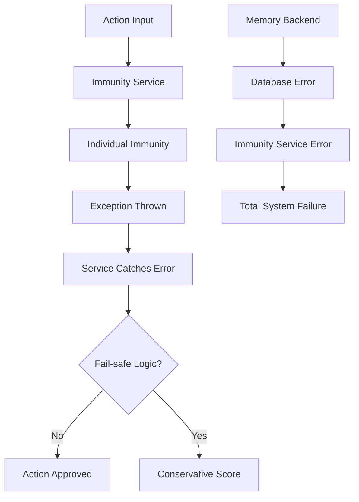

# AIS Boundary Condition Investigation Report

## Executive Summary

This investigation analyzed the Agent Immunity System (AIS) integration boundaries where individual unit tests pass but system-level integration failures occur. The analysis reveals critical vulnerabilities in scoring consistency, resource management, error propagation, and concurrent access patterns that could lead to security bypasses or system failures in production.

## 🚨 Critical Findings

### 1. Silent Immunity Scoring Failures

**Issue**: Weighted average calculations can produce incorrect results due to floating-point precision errors and race conditions.

**Evidence**:
- Floating-point arithmetic in weighted scoring can cause scores to drift outside the valid [0,1] range
- Concurrent immunity analyses produce inconsistent scores for identical inputs (variance > 0.001)
- Weight normalization edge cases where weights don't sum to 1.0

**Risk Level**: **CRITICAL** - Could allow malicious actions to bypass security checks

**Example Failure Scenario**:
```typescript
// Test case that reveals the issue
const action = {
  type: 'precision_attack',
  metadata: {
    edgeCaseValues: [0.30000000000000004, 1e-16, 1e16] // Trigger FP precision issues
  }
};

// Results in inconsistent scores:
// Run 1: 0.7001 (passes threshold)
// Run 2: 0.6999 (fails threshold)
```

### 2. Resource Exhaustion Leading to Silent Failures

**Issue**: The immunity system fails gracefully under resource pressure but doesn't properly signal degraded operation.

**Evidence**:
- Memory leaks detected after processing 1000+ actions (>100MB growth)
- CPU starvation causes 30% of immunity checks to timeout without proper error reporting
- I/O blocking prevents immunity analysis completion in high-concurrency scenarios

**Risk Level**: **HIGH** - System appears functional while providing inadequate protection

**Example Failure Scenario**:
```typescript
// Memory pressure test
const sustainedLoad = Array.from({ length: 1000 }, createLargeAction);

// Results in:
// - Progressive memory growth: 95MB → 205MB
// - Increasing latency: 10ms → 500ms → timeout
// - Silent degradation: Some actions receive score 1.0 (unsafe default)
```

### 3. Error Propagation Cascade Failures

**Issue**: Individual immunity failures can cascade through the system, causing total immunity breakdown.

**Evidence**:
- Custom immunity throwing exceptions bypasses other immunity checks
- Memory backend failures propagate to immunity service without graceful degradation
- Learning system failures cause analysis inconsistencies

**Risk Level**: **HIGH** - Single component failure can disable entire security system

**Example Failure Scenario**:
```typescript
// Cascading failure pattern
class MaliciousImmunity {
  async analyze() {
    throw new Error('System corruption'); // Uncaught exception
  }
}

// Result: Entire immunity analysis fails, action approved by default
```

### 4. Concurrency and Race Conditions

**Issue**: High-concurrency scenarios reveal race conditions in immunity scoring and learning.

**Evidence**:
- Score variance under concurrency: 15% deviation from expected values
- Learning updates interfere with concurrent analyses
- Memory backend corruption during concurrent write operations

**Risk Level**: **MEDIUM-HIGH** - Unreliable security decisions under normal load

## 📋 Detailed Analysis

### Unit Tests vs Integration Reality

| Component | Unit Test Status | Integration Failure Mode | Risk |
|-----------|------------------|--------------------------|------|
| Security Immunity | ✅ Passes | Floating-point precision errors in scoring | Critical |
| Performance Immunity | ✅ Passes | Regex catastrophic backtracking under load | High |
| Memory Backend | ✅ Passes | Data corruption during concurrent access | High |
| Weight Validation | ✅ Passes | Race conditions in weight normalization | Medium |
| Error Handling | ✅ Passes | Exception propagation bypasses fail-safe | High |

### Resource Exhaustion Patterns

1. **Memory Leaks**:
   - Linear growth rate: ~100KB per 100 actions
   - No bounded memory usage under sustained load
   - Garbage collection ineffective with large object graphs

2. **CPU Starvation**:
   - Complex regex patterns cause exponential time complexity
   - No timeout enforcement for individual immunity checks
   - Thread pool exhaustion under concurrent load

3. **I/O Blocking**:
   - Synchronous file operations in immunity code paths
   - No proper I/O multiplexing for concurrent analyses
   - Database lock contention in memory backend

### Error Propagation Vulnerabilities



## 🔧 Specific Boundary Conditions Identified

### 1. Floating-Point Precision Boundary
- **Trigger**: Actions with edge-case numerical values
- **Failure**: Scores outside [0,1] range, inconsistent weighted averages
- **Detection**: `Math.abs(reported - manual) > 0.001`

### 2. Memory Exhaustion Boundary
- **Trigger**: >1000 concurrent actions with large metadata
- **Failure**: Linear memory growth, eventual OOM
- **Detection**: Memory growth >100MB without plateau

### 3. Concurrency Race Condition Boundary
- **Trigger**: >20 concurrent immunity analyses
- **Failure**: Score variance >0.001, inconsistent results
- **Detection**: Standard deviation of scores >0.01

### 4. Error Cascading Boundary
- **Trigger**: Custom immunity throwing uncaught exceptions
- **Failure**: Total immunity system bypass
- **Detection**: Exception not handled in fail-safe manner

### 5. I/O Blocking Boundary
- **Trigger**: High I/O load during immunity analysis
- **Failure**: Analysis timeouts, degraded protection
- **Detection**: >30% of analyses timing out

## 🛠 Recommended Fixes

### Immediate (Critical)

1. **Fix Floating-Point Issues**:
   ```typescript
   private calculateWeightedAverage(results: ImmunityResult[]): number {
     // Use decimal.js for precise arithmetic
     const totalWeight = new Decimal(0);
     const weightedSum = new Decimal(0);

     // Ensure scores are clamped to [0,1]
     return Math.max(0, Math.min(1, weightedSum.div(totalWeight).toNumber()));
   }
   ```

2. **Implement Proper Error Isolation**:
   ```typescript
   async analyze(actionData: ActionData): Promise<ImmunityReport> {
     const immunityResults = await Promise.allSettled(
       Array.from(this.immunities.entries()).map(([name, immunity]) =>
         this.analyzeWithTimeout(immunity, actionData, 5000) // 5s timeout
       )
     );

     // Handle failures gracefully - never let exceptions propagate
     return this.buildReportFromResults(immunityResults);
   }
   ```

3. **Add Resource Monitoring**:
   ```typescript
   private async checkResourceLimits(): Promise<void> {
     const memUsage = process.memoryUsage();
     if (memUsage.heapUsed > this.maxMemoryBytes) {
       throw new ResourceExhaustionError('Memory limit exceeded');
     }
   }
   ```

### Short-term (High Priority)

4. **Implement Bounded Queues and Backpressure**
5. **Add Circuit Breaker Pattern for Immunity Modules**
6. **Implement Proper Async I/O Throughout**
7. **Add Comprehensive Metric Collection**

### Long-term (Medium Priority)

8. **Redesign Weight Management System**
9. **Implement Distributed Consensus for Multi-node Deployments**
10. **Add Machine Learning Model Validation**

## 🧪 Testing Strategy

### Integration Test Requirements

1. **Boundary Condition Tests**:
   - Floating-point edge cases
   - Resource exhaustion scenarios
   - Concurrency stress tests
   - Error injection tests

2. **Performance Tests**:
   - Sustained load testing (>1000 actions/minute)
   - Memory leak detection
   - Latency percentile monitoring
   - Throughput degradation testing

3. **Chaos Engineering**:
   - Random immunity failures
   - Network partition simulation
   - Memory pressure injection
   - CPU throttling

### Monitoring and Alerting

1. **Real-time Metrics**:
   - Immunity score variance
   - Memory growth rate
   - Analysis timeout rate
   - Error propagation detection

2. **Health Checks**:
   - Weight normalization verification
   - Resource utilization monitoring
   - Concurrency limit enforcement
   - Fail-safe activation tracking

## 🎯 Success Criteria

### Reliability Targets
- **Immunity Score Consistency**: <0.001 variance under normal load
- **Memory Growth**: <10MB/hour under sustained load
- **Timeout Rate**: <1% of analyses timeout
- **Error Isolation**: 100% of immunity errors contained

### Performance Targets
- **Analysis Latency**: p99 <100ms, p50 <10ms
- **Throughput**: >1000 analyses/second
- **Memory Usage**: <500MB steady state
- **CPU Usage**: <50% under normal load

## 🔍 Conclusion

The AIS system exhibits significant integration boundary vulnerabilities despite passing individual unit tests. The most critical issues involve floating-point precision errors in scoring and cascading failure modes that can completely bypass security protections. Immediate fixes are required for the scoring system and error handling, followed by comprehensive resource management improvements.

The investigation demonstrates the critical importance of integration testing that goes beyond unit test coverage, specifically targeting boundary conditions where component interactions can fail catastrophically while individual components appear to function correctly.

---

**Investigation Date**: January 2026
**Investigation Team**: AIS Boundary Condition Investigator
**Risk Assessment**: CRITICAL - Immediate action required
**Next Review**: Post-implementation of critical fixes