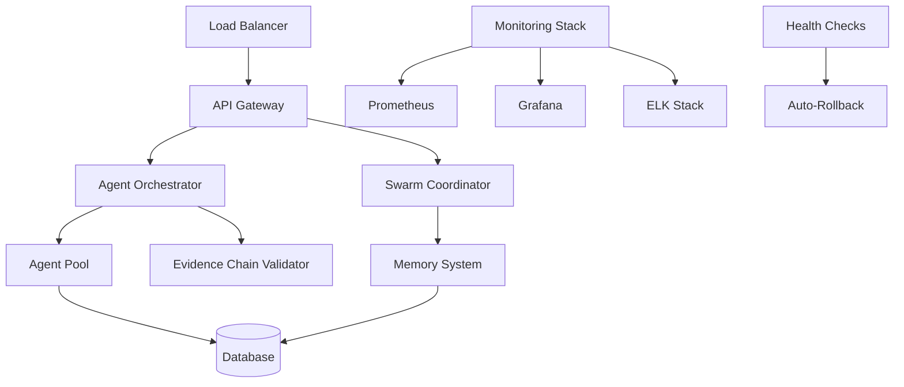

# Production Operational Procedures

## Overview

This document outlines the operational procedures for the AIS Production Environment, including deployment processes, monitoring protocols, incident response plans, and maintenance procedures.

## Table of Contents

1. [Production Architecture](#production-architecture)
2. [Deployment Procedures](#deployment-procedures)
3. [Evidence Chains Validation](#evidence-chains-validation)
4. [Monitoring and Alerting](#monitoring-and-alerting)
5. [Incident Response](#incident-response)
6. [Rollback Procedures](#rollback-procedures)
7. [Maintenance Windows](#maintenance-windows)
8. [Security Protocols](#security-protocols)
9. [Performance Management](#performance-management)
10. [Troubleshooting Guide](#troubleshooting-guide)

## Production Architecture

### System Components



### Infrastructure Components

- **Application Servers**: Kubernetes cluster with auto-scaling
- **Database**: PostgreSQL with read replicas
- **Cache**: Redis cluster for session and agent state
- **Message Queue**: RabbitMQ for inter-agent communication
- **Storage**: S3-compatible object storage for artifacts
- **Monitoring**: Prometheus, Grafana, ELK stack
- **Security**: WAF, API rate limiting, mTLS

## Deployment Procedures

### 1. Pre-Deployment Checklist

**Required Approvals:**
- [ ] Product Owner approval for feature completeness
- [ ] Technical Lead approval for code quality
- [ ] Security Team approval for security review
- [ ] Operations Team approval for deployment readiness

**Technical Prerequisites:**
- [ ] All unit tests passing (>95% coverage)
- [ ] Integration tests passing
- [ ] Security scans completed with no critical vulnerabilities
- [ ] Performance tests meeting SLA requirements
- [ ] Database migration scripts reviewed and tested
- [ ] Rollback plan documented and tested

**Evidence Chain Validation:**
- [ ] Functional testing evidence (confidence >90%)
- [ ] Security scan evidence (no critical/high vulnerabilities)
- [ ] Performance test evidence (meeting baseline +10%)
- [ ] Integration test evidence (all critical paths tested)
- [ ] Manual testing evidence (UAT completed)

### 2. Deployment Process

```bash
# 1. Start deployment with evidence validation
curl -X POST /api/deployments \
  -H "Authorization: Bearer ${DEPLOYMENT_TOKEN}" \
  -d '{
    "applicationName": "ais-production",
    "version": "v2.1.0",
    "environment": "production",
    "strategy": "blue_green",
    "evidenceValidation": {
      "requiredEvidenceTypes": [
        "functional_test",
        "security_scan",
        "performance_test",
        "integration_test"
      ],
      "passThreshold": 85,
      "requireManualAttestation": true
    }
  }'

# 2. Monitor deployment progress
watch -n 5 curl -s /api/deployments/${DEPLOYMENT_ID}/status

# 3. Approve phases as required
curl -X POST /api/deployments/${DEPLOYMENT_ID}/approve \
  -H "Authorization: Bearer ${APPROVAL_TOKEN}" \
  -d '{"phase": "deployment", "approved": true}'
```

### 3. Post-Deployment Verification

**Immediate Checks (0-5 minutes):**
- [ ] Health checks passing across all instances
- [ ] Application startup logs show no errors
- [ ] Database connections established
- [ ] Cache connectivity verified
- [ ] API endpoints responding correctly

**Short-term Monitoring (5-30 minutes):**
- [ ] Memory usage within expected ranges
- [ ] CPU utilization normal
- [ ] Response times meeting SLA
- [ ] Error rates below threshold
- [ ] Agent spawning functionality working

**Long-term Validation (30 minutes - 2 hours):**
- [ ] User acceptance testing completed
- [ ] Performance under load validated
- [ ] All integrated systems functioning
- [ ] Business metrics showing expected behavior

## Evidence Chains Validation

### Overview

Evidence Chains provide automated validation with confidence scoring to ensure production readiness. Each deployment must pass evidence validation before proceeding.

### Evidence Types and Criteria

| Evidence Type | Required Confidence | Critical | Timeout |
|--------------|-------------------|----------|---------|
| Functional Tests | >90% | Yes | 10 min |
| Security Scan | >95% | Yes | 15 min |
| Performance Tests | >85% | Yes | 20 min |
| Integration Tests | >90% | Yes | 15 min |
| Code Review | >80% | No | N/A |
| Documentation Review | >75% | No | N/A |

### Validation Process

1. **Automated Evidence Collection**
   ```bash
   # Evidence chain automatically executes:
   - Functional test suite
   - Security vulnerability scans
   - Performance benchmarks
   - Integration test matrix
   ```

2. **Confidence Scoring**
   ```javascript
   // Each evidence type gets scored 0-100%
   functionalTests: 95%    // 148/150 tests passed
   securityScan: 98%       // No critical/high vulns
   performanceTests: 87%   // Met 87% of SLA targets
   integrationTests: 92%   // All critical paths OK

   // Overall confidence: weighted average
   overallConfidence: 93%
   ```

3. **Manual Attestation**
   ```bash
   # Required for production deployments
   curl -X POST /api/evidence-chains/${CHAIN_ID}/attest \
     -d '{
       "attestedBy": "tech-lead",
       "approved": true,
       "comments": "All validations passed, ready for prod",
       "signature": "signed_hash"
     }'
   ```

## Monitoring and Alerting

### Key Metrics

**Application Metrics:**
- Response time (95th percentile) < 500ms
- Throughput > 1000 requests/second
- Error rate < 0.1%
- Agent spawn time < 2 seconds
- Swarm coordination latency < 100ms

**Infrastructure Metrics:**
- CPU utilization < 70%
- Memory utilization < 75%
- Disk I/O < 80% capacity
- Network latency < 50ms
- Database query time < 100ms

**Business Metrics:**
- Active agent count
- Task completion rate > 99%
- Evidence chain validation success > 95%
- User session duration
- API adoption metrics

### Alert Levels

**P0 - Critical (Immediate Response):**
- Application completely down
- Database connection failures
- Security breach detected
- Data corruption identified
- Multiple evidence chain failures

**P1 - High (Response within 15 minutes):**
- Error rate > 1%
- Response time > 2 seconds
- Memory usage > 85%
- Failed health checks
- Agent spawn failures

**P2 - Medium (Response within 1 hour):**
- Performance degradation
- Evidence chain warnings
- Capacity approaching limits
- Non-critical security alerts

**P3 - Low (Response within 4 hours):**
- Documentation out of sync
- Non-functional requirements not met
- Optimization opportunities identified

### Alert Channels

```yaml
# Alert routing configuration
alerts:
  critical:
    - PagerDuty (immediate)
    - Slack #incidents
    - SMS to on-call engineer

  high:
    - Slack #production-alerts
    - Email to team leads

  medium:
    - Slack #monitoring
    - Email digest

  low:
    - Weekly summary report
```

## Incident Response

### Incident Classification

**Severity 1 (Critical):**
- Complete service outage
- Data loss or corruption
- Security breach
- Financial impact > $10K/hour

**Severity 2 (High):**
- Major functionality impaired
- Performance severely degraded
- Subset of users affected
- Financial impact < $10K/hour

**Severity 3 (Medium):**
- Minor functionality issues
- Workaround available
- Limited user impact

**Severity 4 (Low):**
- Cosmetic issues
- Enhancement requests
- No user impact

### Response Procedures

**Immediate Response (0-5 minutes):**
1. Acknowledge alert in monitoring system
2. Assess severity and impact
3. Notify appropriate stakeholders
4. Begin initial investigation
5. Consider immediate rollback if applicable

**Short-term Response (5-30 minutes):**
1. Implement immediate mitigation
2. Escalate if severity 1 or 2
3. Begin detailed investigation
4. Update status page if user-facing
5. Communicate with stakeholders

**Resolution Phase:**
1. Identify root cause
2. Implement permanent fix
3. Test fix thoroughly
4. Deploy fix using standard procedures
5. Verify resolution
6. Update documentation

**Post-Incident:**
1. Conduct post-mortem review
2. Document lessons learned
3. Update procedures if necessary
4. Implement preventive measures
5. Share knowledge with team

### Emergency Contacts

```
Primary On-Call: +1-555-0100
Secondary On-Call: +1-555-0101
Incident Commander: +1-555-0102
Database Admin: +1-555-0103
Security Team: +1-555-0104
```

### Communication Templates

**Initial Alert:**
```
🚨 INCIDENT ALERT - SEV-{X}

Service: AIS Production
Issue: {brief description}
Impact: {user/business impact}
Status: Investigating
ETA: {estimated resolution time}
Incident Commander: {name}
```

**Update:**
```
📊 INCIDENT UPDATE - SEV-{X}

Progress: {current status}
Actions Taken: {what's been done}
Next Steps: {what's being done next}
ETA: {updated estimate}
```

**Resolution:**
```
✅ INCIDENT RESOLVED - SEV-{X}

Resolution: {what was fixed}
Root Cause: {identified cause}
Prevention: {preventive measures}
Post-Mortem: {scheduled date/time}
```

## Rollback Procedures

### Automated Rollback Triggers

**Health Check Failures:**
- 3 consecutive health check failures
- Memory usage > 90% for 5 minutes
- Error rate > 5% for 2 minutes
- Response time > 5 seconds for 3 minutes

**Manual Rollback Decision Points:**
- Evidence chain validation fails
- Performance degradation beyond acceptable limits
- Security vulnerability discovered in new version
- Business stakeholder requests rollback

### Rollback Process

**Immediate Rollback (Blue-Green):**
```bash
# Switch traffic back to previous version
kubectl patch service ais-production -p \
  '{"spec":{"selector":{"version":"previous"}}}'

# Verify health
curl -f https://api.production.com/health

# Monitor metrics for 15 minutes
```

**Rolling Rollback:**
```bash
# Scale down new version gradually
kubectl scale deployment ais-production-new --replicas=0

# Scale up previous version
kubectl scale deployment ais-production-previous --replicas=6

# Monitor and verify
```

**Database Rollback:**
```sql
-- Only if schema changes were made
-- Use pre-approved rollback scripts
\i rollback-scripts/v2.1.0-to-v2.0.9.sql

-- Verify data integrity
SELECT COUNT(*) FROM critical_tables;
```

### Rollback Verification

**Post-Rollback Checks:**
- [ ] All services healthy
- [ ] Database connectivity restored
- [ ] Cache functionality working
- [ ] API endpoints responding correctly
- [ ] Business metrics returning to baseline
- [ ] No data integrity issues
- [ ] User functionality verified

## Maintenance Windows

### Scheduled Maintenance

**Regular Maintenance:**
- **Weekly**: Security patches (Sundays 2-4 AM EST)
- **Monthly**: Infrastructure updates (1st Sunday 1-5 AM EST)
- **Quarterly**: Major version upgrades (Planned 2 weeks ahead)

**Emergency Maintenance:**
- Critical security patches: Immediate
- Critical bug fixes: Within 24 hours
- Performance improvements: Next maintenance window

### Maintenance Procedures

**Pre-Maintenance:**
1. Schedule maintenance window
2. Notify stakeholders 72 hours in advance
3. Prepare rollback plan
4. Test changes in staging
5. Verify backup systems

**During Maintenance:**
1. Enable maintenance mode
2. Drain traffic gradually
3. Perform updates
4. Run verification tests
5. Restore traffic

**Post-Maintenance:**
1. Monitor system health
2. Verify all functionality
3. Update documentation
4. Communicate completion
5. Schedule post-maintenance review

## Security Protocols

### Access Controls

**Production Access:**
- Principle of least privilege
- Just-in-time access using approved tools
- Multi-factor authentication required
- All access logged and monitored
- Regular access reviews

**API Security:**
- Rate limiting: 1000 requests/minute per IP
- API key authentication required
- mTLS for service-to-service communication
- Input validation and sanitization
- CORS policies enforced

**Data Protection:**
- Encryption at rest and in transit
- PII data handling procedures
- Data retention policies
- Backup encryption
- Secure key management

### Security Monitoring

**Automated Scanning:**
- SAST (Static Application Security Testing)
- DAST (Dynamic Application Security Testing)
- Dependency vulnerability scanning
- Infrastructure security scanning
- Compliance monitoring

**Incident Response:**
- Security incident playbooks
- Forensic investigation procedures
- Breach notification protocols
- Regulatory compliance requirements
- Third-party security assessments

## Performance Management

### Performance Targets

| Metric | Target | Warning | Critical |
|--------|--------|---------|----------|
| Response Time (p95) | <500ms | <1s | <2s |
| Throughput | >1000 RPS | >500 RPS | >100 RPS |
| Error Rate | <0.1% | <1% | <5% |
| Availability | >99.9% | >99.5% | >99% |
| Agent Spawn Time | <2s | <5s | <10s |

### Performance Optimization

**Regular Optimization:**
- Weekly performance reviews
- Profiling analysis
- Database query optimization
- Cache hit rate optimization
- Resource utilization analysis

**Performance Testing:**
- Load testing (monthly)
- Stress testing (quarterly)
- Endurance testing (semi-annually)
- Spike testing (after major releases)
- Volume testing (with production data)

### Capacity Planning

**Growth Planning:**
- Monitor trends monthly
- Capacity forecasting quarterly
- Resource scaling automation
- Cost optimization reviews
- Performance trend analysis

## Troubleshooting Guide

### Common Issues

**Application Won't Start:**
1. Check environment variables
2. Verify database connectivity
3. Check service dependencies
4. Review startup logs
5. Validate configuration files

**Performance Issues:**
1. Check system resources (CPU, memory, disk)
2. Analyze database query performance
3. Review cache hit rates
4. Examine network latency
5. Profile application code

**Agent Spawning Failures:**
1. Check agent pool capacity
2. Verify swarm coordinator health
3. Review memory allocation
4. Check agent dependencies
5. Validate agent configurations

**Evidence Chain Failures:**
1. Review test execution logs
2. Check security scan results
3. Verify performance benchmarks
4. Validate integration test data
5. Check evidence validation criteria

### Debug Commands

```bash
# System health overview
curl -s /api/health?detailed=true | jq

# Agent system status
curl -s /api/agents/status | jq

# Swarm coordination health
curl -s /api/swarm/status | jq

# Evidence chain status
curl -s /api/evidence-chains/active | jq

# Performance metrics
curl -s /metrics | grep -E "(response_time|error_rate|throughput)"

# Database connectivity
psql -h $DB_HOST -U $DB_USER -d $DB_NAME -c "SELECT 1;"

# Cache connectivity
redis-cli -h $REDIS_HOST ping

# View recent logs
kubectl logs -f deployment/ais-production --tail=100

# Check resource usage
kubectl top pods -l app=ais-production
```

### Escalation Procedures

**Level 1: Development Team**
- Initial triage and investigation
- Common issue resolution
- Documentation updates

**Level 2: Senior Engineers**
- Complex issue investigation
- Architecture-level problems
- Performance optimization

**Level 3: Technical Leadership**
- Critical system issues
- Major architecture decisions
- Incident command

**Level 4: External Vendors**
- Third-party service issues
- Infrastructure provider problems
- Specialist consulting

---

## Appendices

### A. Configuration Templates
### B. Monitoring Dashboards
### C. Alert Runbooks
### D. Security Checklists
### E. Performance Baselines

---

*This document is maintained by the Production Operations Team and should be reviewed quarterly for accuracy and completeness.*