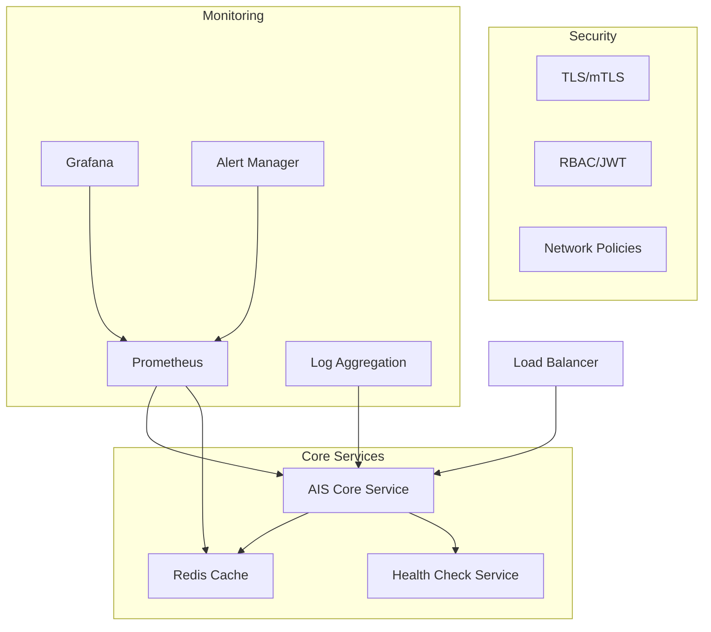

# AIS Plugin Production Deployment

> **Agent Immunity System (AIS) Plugin** - Production-ready deployment infrastructure with comprehensive monitoring, security hardening, and operational excellence.

[](./docs/DEPLOYMENT_GUIDE.md)
[](./docs/SECURITY_HARDENING.md)
[](./docs/PERFORMANCE_TUNING.md)
[](./monitoring/)

## 🚀 Quick Start

### Docker Deployment (Recommended for Testing)

```bash
# Set required environment variables
export REDIS_PASSWORD="your-secure-redis-password"
export GRAFANA_PASSWORD="your-grafana-admin-password"

# Deploy all services with monitoring
./scripts/deploy.sh -t docker -e production

# Verify deployment
curl http://localhost:8080/health
curl http://localhost:8080/immunity
```

### Kubernetes Deployment (Production)

```bash
# Create namespace and secrets
kubectl create namespace claude-flow
kubectl create secret generic ais-secrets \
    --from-literal=redis_password="secure-password" \
    -n claude-flow

# Deploy with full production configuration
./scripts/deploy.sh -t kubernetes -n claude-flow -e production

# Verify deployment
kubectl get pods -n claude-flow -l app=ais-plugin
kubectl port-forward -n claude-flow service/ais-plugin-service 8080:8080
curl http://localhost:8080/health
```

## 📋 Deployment Architecture



## 🏗️ Infrastructure Components

### Core Services

| Component | Purpose | Ports | Resources |
|-----------|---------|-------|-----------|
| **AIS Core** | Main immunity service | 8080 (health), 9090 (metrics) | 1 CPU, 512MB RAM |
| **Redis** | State cache & memory | 6379 | 0.5 CPU, 256MB RAM |
| **Health Check** | Service monitoring | 8080 | Minimal |

### Monitoring Stack

| Component | Purpose | Ports | Access |
|-----------|---------|-------|--------|
| **Prometheus** | Metrics collection | 9091 | Internal |
| **Grafana** | Dashboards | 3000 | `admin/[GRAFANA_PASSWORD]` |
| **AlertManager** | Alert routing | 9093 | Internal |

### Security Features

- 🔒 **Container Security**: Distroless images, non-root execution, read-only filesystem
- 🛡️ **Network Security**: TLS 1.3, mTLS, network policies, firewall rules
- 🔑 **Authentication**: JWT with RS256, RBAC, API key management
- 🔐 **Data Protection**: AES-256 encryption at rest, secure key rotation
- 📊 **Audit Logging**: Comprehensive security event logging

## 📁 Directory Structure

```
deployment/
├── docker/                     # Docker Compose deployment
│   ├── Dockerfile              # Multi-stage secure container build
│   ├── docker-compose.yml      # Full stack with monitoring
│   └── .env.example            # Environment configuration template
├── kubernetes/                 # Kubernetes manifests
│   ├── ais-deployment.yaml     # Core service deployment
│   ├── monitoring.yaml         # Monitoring stack
│   ├── secrets.yaml            # Secret management
│   └── network-policies.yaml   # Network security policies
├── monitoring/                 # Monitoring configuration
│   ├── prometheus.yml          # Metrics collection config
│   ├── alerts.yml              # Alert rules
│   └── grafana/               # Dashboard definitions
│       ├── dashboards/         # Pre-built dashboards
│       └── datasources/        # Data source configurations
├── health/                     # Health check service
│   └── health-check.js         # Comprehensive health monitoring
├── scripts/                    # Deployment automation
│   ├── deploy.sh              # Main deployment script
│   ├── backup.sh              # Backup automation
│   └── rollback.sh            # Rollback procedures
└── docs/                      # Documentation
    ├── DEPLOYMENT_GUIDE.md    # Complete deployment guide
    ├── API_DOCUMENTATION.md   # API reference
    ├── PERFORMANCE_TUNING.md  # Performance optimization
    └── SECURITY_HARDENING.md  # Security best practices
```

## 🎯 Performance Targets

| Metric | Target | Monitoring | Alert Threshold |
|--------|--------|------------|-----------------|
| **Response Time (P95)** | <30ms | Prometheus | >40ms |
| **Uptime** | 99.9% | Health checks | <99.5% |
| **Immunity Violations** | <5% | Real-time | >10% |
| **Memory Usage** | <512MB | Container metrics | >768MB |
| **CPU Usage** | <50% | cAdvisor | >70% |

## 🔧 Configuration

### Environment Variables

```bash
# Core Configuration
NODE_ENV=production
AIS_LOG_LEVEL=info
AIS_HEALTH_PORT=8080
AIS_METRICS_PORT=9090

# Immunity Settings
AIS_IMMUNITY_THRESHOLD=0.8
AIS_EXTENDED_IMMUNITIES=true
AIS_PERFORMANCE_TARGET_MS=30

# Security
REDIS_PASSWORD=secure-password
GRAFANA_PASSWORD=admin-password
JWT_SECRET=jwt-signing-secret
MASTER_ENCRYPTION_KEY=base64-encoded-key

# Infrastructure
REDIS_HOST=ais-redis-service
PROMETHEUS_URL=http://ais-prometheus:9090
```

### Immunity Configuration

```json
{
  "immunities": {
    "security": {
      "enabled": true,
      "weight": 1.0,
      "threshold": 0.8,
      "sensitivity": "high"
    },
    "truth": {
      "enabled": true,
      "weight": 0.9,
      "threshold": 0.75,
      "sensitivity": "medium"
    },
    "performance": {
      "enabled": true,
      "weight": 0.8,
      "threshold": 0.8,
      "sensitivity": "low",
      "responseTimeTarget": 30
    },
    "coherence": {
      "enabled": true,
      "weight": 0.7,
      "threshold": 0.8
    },
    "dependencies": {
      "enabled": true,
      "weight": 0.6,
      "threshold": 0.8
    }
  }
}
```

## 📊 Monitoring & Alerting

### Pre-configured Dashboards

- **AIS Production Overview**: Service health, performance metrics, violation rates
- **Security Dashboard**: Authentication, authorization, security events
- **Performance Analysis**: Response times, resource usage, bottlenecks
- **Infrastructure Health**: Container metrics, network, storage

### Critical Alerts

| Alert | Trigger | Severity | Action |
|-------|---------|----------|---------|
| **Service Down** | Health check failure | Critical | Auto-restart, escalate |
| **High Violations** | >5 violations/5min | Critical | Investigate immediately |
| **Performance SLA** | Response >30ms/1min | Warning | Scale or optimize |
| **Security Breach** | Auth failures | Critical | Security team alert |

### Health Check Endpoints

```bash
# Basic health check
curl http://localhost:8080/health
# Returns: {"status":"healthy","uptime":3600,"responseTime":12}

# Detailed immunity status
curl http://localhost:8080/immunity
# Returns: Comprehensive immunity system status

# Prometheus metrics
curl http://localhost:8080/metrics
# Returns: Prometheus-format metrics

# Readiness probe
curl http://localhost:8080/ready
# Returns: Kubernetes readiness status
```

## 🛡️ Security Features

### Container Security
- **Distroless base images** for minimal attack surface
- **Non-root execution** with dedicated user (uid: 65534)
- **Read-only root filesystem** with tmpfs for writable areas
- **Dropped capabilities** (ALL removed, none added)
- **Security contexts** applied at pod and container levels

### Network Security
- **TLS 1.3** for all external communication
- **mTLS** for service-to-service communication
- **Network policies** restricting traffic flow
- **Firewall rules** for additional perimeter security

### Data Protection
- **AES-256 encryption** for data at rest
- **JWT with RS256** for authentication tokens
- **Secure key rotation** automated procedures
- **Input sanitization** preventing injection attacks

## 🚀 Deployment Scenarios

### Development Environment

```bash
./scripts/deploy.sh -t docker -e development --skip-security
```

### Staging Environment

```bash
./scripts/deploy.sh -t kubernetes -e staging -n staging --canary 50
```

### Production Deployment

```bash
# Full production deployment with all security measures
./scripts/deploy.sh -t kubernetes -e production -n claude-flow --canary 10

# Zero-downtime rolling update
kubectl set image deployment/ais-plugin ais-core=claude-flow/agent-immunity:3.0.0-alpha.2
```

### Canary Deployment

```bash
# Deploy to 10% of traffic
./scripts/deploy.sh -t kubernetes --canary 10

# Monitor for issues, then promote to 100%
./scripts/deploy.sh -t kubernetes --canary 100
```

## 🔄 Operational Procedures

### Backup

```bash
# Automated daily backups
./scripts/backup.sh --type full --retention 7days

# Manual configuration backup
kubectl get configmaps,secrets -n claude-flow -o yaml > backup-$(date +%Y%m%d).yaml
```

### Rollback

```bash
# Quick rollback to previous version
kubectl rollout undo deployment/ais-plugin -n claude-flow

# Rollback using backup
./scripts/rollback.sh --backup backup-20240125.yaml
```

### Scaling

```bash
# Manual scaling
kubectl scale deployment ais-plugin --replicas=5 -n claude-flow

# Auto-scaling (configured by default)
kubectl get hpa -n claude-flow
```

## 📚 Documentation

- **[📖 Complete Deployment Guide](./docs/DEPLOYMENT_GUIDE.md)**: Comprehensive setup and configuration
- **[🔌 API Documentation](./docs/API_DOCUMENTATION.md)**: Complete API reference with examples
- **[⚡ Performance Tuning](./docs/PERFORMANCE_TUNING.md)**: Optimization strategies and benchmarking
- **[🛡️ Security Hardening](./docs/SECURITY_HARDENING.md)**: Security best practices and compliance

## 🆘 Troubleshooting

### Common Issues

**Service Won't Start:**
```bash
# Check logs
kubectl logs deployment/ais-plugin -n claude-flow
docker logs ais-core

# Check configuration
kubectl describe deployment ais-plugin -n claude-flow
```

**High Response Times:**
```bash
# Check resource usage
kubectl top pods -n claude-flow
docker stats ais-core

# Check immunity violations
curl http://localhost:8080/immunity | jq '.violations'
```

**Memory Issues:**
```bash
# Force garbage collection
curl -X POST http://localhost:8080/debug/gc

# Check memory leaks
kubectl exec -it deployment/ais-plugin -n claude-flow -- node --inspect-brk=0.0.0.0:9229 app.js
```

### Support Contacts

- **Issues**: [GitHub Issues](https://github.com/ruvnet/claude-flow/issues)
- **Documentation**: [Claude Flow Docs](https://docs.claude-flow.com)
- **Security**: security@claude-flow.com
- **Performance**: performance@claude-flow.com

---

## 🏆 Production Readiness Checklist

- [x] **Security Hardening**: Container security, network policies, encryption
- [x] **High Availability**: Multi-replica deployment, health checks, auto-restart
- [x] **Monitoring**: Comprehensive metrics, alerting, dashboards
- [x] **Performance**: Sub-30ms response times, auto-scaling, load testing
- [x] **Backup & Recovery**: Automated backups, rollback procedures
- [x] **Documentation**: Complete deployment, API, and operational guides
- [x] **Compliance**: Audit logging, security scanning, compliance reporting

**Ready for production deployment! 🚀**