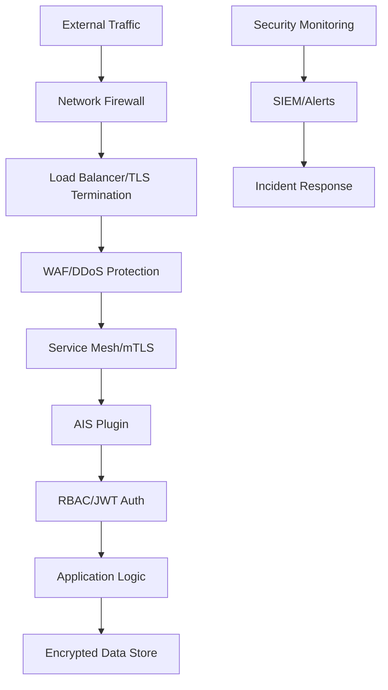

# AIS Plugin Security Hardening Guide

## Table of Contents

1. [Security Overview](#security-overview)
2. [Container Security](#container-security)
3. [Network Security](#network-security)
4. [Authentication & Authorization](#authentication--authorization)
5. [Data Protection](#data-protection)
6. [Secrets Management](#secrets-management)
7. [Audit & Compliance](#audit--compliance)
8. [Incident Response](#incident-response)
9. [Security Monitoring](#security-monitoring)
10. [Vulnerability Management](#vulnerability-management)

## Security Overview

The AIS Plugin implements defense-in-depth security principles with multiple layers of protection to ensure immunity system integrity and prevent security breaches that could compromise agent behavior.

### Security Architecture



### Security Controls Framework

| Layer | Control Type | Implementation | Risk Mitigation |
|-------|--------------|----------------|-----------------|
| Network | Perimeter Defense | Firewall, WAF, DDoS protection | External attacks |
| Transport | Encryption | TLS 1.3, mTLS | Data in transit |
| Application | Authentication | JWT, RBAC, API keys | Unauthorized access |
| Data | Encryption | AES-256, key rotation | Data at rest |
| Runtime | Sandboxing | Containers, AppArmor/SELinux | Privilege escalation |
| Monitoring | Detection | SIEM, anomaly detection | Breach detection |

## Container Security

### Base Image Hardening

**Distroless Images:**
```dockerfile
# Use Google's distroless Node.js image for minimal attack surface
FROM gcr.io/distroless/nodejs20-debian12:nonroot

# Security labels for compliance
LABEL security.distroless="true" \
      security.nonroot="true" \
      security.readonly="true" \
      security.capabilities="dropped"

# Copy only necessary files
COPY --chown=nonroot:nonroot dist/ /app/
COPY --chown=nonroot:nonroot node_modules/ /app/node_modules/

# Run as non-root user (distroless default)
USER nonroot:nonroot

# Read-only root filesystem
VOLUME ["/tmp"]
```

**Security Scanning Integration:**
```yaml
# .github/workflows/security-scan.yml
name: Container Security Scan

on:
  push:
    branches: [main]
  pull_request:
    branches: [main]

jobs:
  security-scan:
    runs-on: ubuntu-latest
    steps:
    - uses: actions/checkout@v3

    - name: Build image
      run: docker build -t ais-plugin:${{ github.sha }} .

    - name: Run Trivy vulnerability scanner
      uses: aquasecurity/trivy-action@master
      with:
        image-ref: ais-plugin:${{ github.sha }}
        format: 'sarif'
        output: 'trivy-results.sarif'
        severity: 'CRITICAL,HIGH'
        exit-code: '1'

    - name: Upload Trivy scan results
      uses: github/codeql-action/upload-sarif@v2
      with:
        sarif_file: 'trivy-results.sarif'

    - name: Run Snyk to check for vulnerabilities
      uses: snyk/actions/docker@master
      env:
        SNYK_TOKEN: ${{ secrets.SNYK_TOKEN }}
      with:
        image: ais-plugin:${{ github.sha }}
        args: --severity-threshold=high
```

### Runtime Security

**Pod Security Standards:**
```yaml
apiVersion: v1
kind: Pod
metadata:
  name: ais-plugin
  annotations:
    # Pod Security Standards
    seccomp.security.alpha.kubernetes.io/pod: runtime/default
    apparmor.security.beta.kubernetes.io/ais-core: runtime/default
spec:
  securityContext:
    # Pod-level security context
    runAsNonRoot: true
    runAsUser: 65534  # nobody
    runAsGroup: 65534
    fsGroup: 65534
    fsGroupChangePolicy: "OnRootMismatch"
    seccompProfile:
      type: RuntimeDefault

  containers:
  - name: ais-core
    image: claude-flow/agent-immunity:3.0.0-alpha.1

    securityContext:
      # Container-level security context
      allowPrivilegeEscalation: false
      readOnlyRootFilesystem: true
      runAsNonRoot: true
      runAsUser: 65534
      runAsGroup: 65534

      # Drop all capabilities
      capabilities:
        drop:
        - ALL
        # Add only if needed (none required for AIS)
        add: []

      # SELinux options (if enabled)
      seLinuxOptions:
        level: "s0:c123,c456"

    # Resource limits for security
    resources:
      limits:
        cpu: "1000m"
        memory: "512Mi"
        ephemeral-storage: "1Gi"
      requests:
        cpu: "100m"
        memory: "128Mi"
        ephemeral-storage: "100Mi"

    # Writable volumes for read-only filesystem
    volumeMounts:
    - name: tmp
      mountPath: /tmp
      readOnly: false
    - name: var-tmp
      mountPath: /var/tmp
      readOnly: false

  volumes:
  - name: tmp
    emptyDir:
      sizeLimit: "100Mi"
  - name: var-tmp
    emptyDir:
      sizeLimit: "100Mi"
```

**AppArmor Profile:**
```bash
# /etc/apparmor.d/ais-plugin
profile ais-plugin flags=(attach_disconnected,mediate_deleted) {
  #include <tunables/global>

  # Capabilities
  deny capability sys_admin,
  deny capability sys_ptrace,
  deny capability dac_override,
  deny capability dac_read_search,

  # Network access
  network inet stream,
  network inet6 stream,

  # File system access
  /app/** r,
  /tmp/** rw,
  /var/tmp/** rw,

  # Deny sensitive paths
  deny /etc/passwd r,
  deny /etc/shadow r,
  deny /etc/ssh/** r,
  deny /root/** rwklx,
  deny /home/** rwklx,
  deny /var/log/** w,

  # Node.js specific
  /usr/bin/node ix,
  /nodejs/bin/node ix,

  # Library access
  /lib/** mr,
  /usr/lib/** mr,
  /lib64/** mr,

  # Proc access (limited)
  @{PROC}/sys/kernel/version r,
  @{PROC}/meminfo r,
  @{PROC}/stat r,
  @{PROC}/uptime r,
  @{PROC}/loadavg r,

  deny @{PROC}/kcore r,
  deny @{PROC}/kallsyms r,
  deny @{PROC}/kmem r,
  deny @{PROC}/mem r,
}
```

## Network Security

### TLS/SSL Configuration

**TLS Best Practices:**
```javascript
// tls-config.js
const tls = require('tls');
const https = require('https');
const fs = require('fs');

class SecureTLSConfig {
    constructor() {
        this.tlsOptions = {
            // TLS version constraints
            minVersion: 'TLSv1.3',
            maxVersion: 'TLSv1.3',

            // Certificate configuration
            cert: fs.readFileSync('/etc/ssl/certs/ais-plugin.pem'),
            key: fs.readFileSync('/etc/ssl/private/ais-plugin.key'),
            ca: fs.readFileSync('/etc/ssl/certs/ca-bundle.pem'),

            // Security settings
            honorCipherOrder: true,
            secureProtocol: 'TLSv1_3_method',

            // Client certificate verification
            requestCert: true,
            rejectUnauthorized: true,

            // Perfect Forward Secrecy
            dhparam: fs.readFileSync('/etc/ssl/dhparam.pem'),

            // OCSP stapling
            crl: fs.readFileSync('/etc/ssl/crl.pem'),

            // Session management
            sessionIdContext: 'ais-plugin',
            sessionTimeout: 300
        };
    }

    createSecureServer(app) {
        const server = https.createServer(this.tlsOptions, app);

        // Security headers middleware
        app.use((req, res, next) => {
            // HSTS header
            res.setHeader('Strict-Transport-Security', 'max-age=31536000; includeSubDomains; preload');

            // Content Security Policy
            res.setHeader('Content-Security-Policy', "default-src 'self'; script-src 'self'; style-src 'self' 'unsafe-inline'; img-src 'self' data:; connect-src 'self'; font-src 'self'; object-src 'none'; media-src 'self'; form-action 'self'; frame-ancestors 'none';");

            // X-Frame-Options
            res.setHeader('X-Frame-Options', 'DENY');

            // X-Content-Type-Options
            res.setHeader('X-Content-Type-Options', 'nosniff');

            // X-XSS-Protection
            res.setHeader('X-XSS-Protection', '1; mode=block');

            // Referrer Policy
            res.setHeader('Referrer-Policy', 'strict-origin-when-cross-origin');

            // Permissions Policy
            res.setHeader('Permissions-Policy', 'camera=(), microphone=(), geolocation=(), interest-cohort=()');

            next();
        });

        return server;
    }
}
```

**Certificate Management:**
```bash
#!/bin/bash
# cert-management.sh

# Generate strong Diffie-Hellman parameters
openssl dhparam -out /etc/ssl/dhparam.pem 4096

# Generate certificate signing request
openssl req -new -sha256 -key /etc/ssl/private/ais-plugin.key \
    -out /etc/ssl/certs/ais-plugin.csr \
    -config <(cat <<EOF
[req]
distinguished_name = req_distinguished_name
req_extensions = v3_req
prompt = no

[req_distinguished_name]
CN = ais.claude-flow.com
O = Claude Flow
OU = Agent Immunity System
C = US
ST = CA
L = San Francisco

[v3_req]
basicConstraints = CA:FALSE
keyUsage = nonRepudiation, digitalSignature, keyEncipherment
subjectAltName = @alt_names

[alt_names]
DNS.1 = ais.claude-flow.com
DNS.2 = ais-plugin-service.claude-flow.svc.cluster.local
IP.1 = 127.0.0.1
EOF
)

# Certificate renewal automation
cat > /etc/cron.d/cert-renewal << EOF
0 2 * * 0 /usr/local/bin/renew-certs.sh
EOF
```

### Network Policies

**Kubernetes Network Policies:**
```yaml
apiVersion: networking.k8s.io/v1
kind: NetworkPolicy
metadata:
  name: ais-plugin-netpol
  namespace: claude-flow
spec:
  podSelector:
    matchLabels:
      app: ais-plugin

  policyTypes:
  - Ingress
  - Egress

  ingress:
  # Allow health checks from monitoring
  - from:
    - namespaceSelector:
        matchLabels:
          name: monitoring
    ports:
    - protocol: TCP
      port: 8080

  # Allow metrics collection
  - from:
    - namespaceSelector:
        matchLabels:
          name: monitoring
    - podSelector:
        matchLabels:
          app: prometheus
    ports:
    - protocol: TCP
      port: 9090

  # Allow API access from authorized clients
  - from:
    - namespaceSelector:
        matchLabels:
          name: claude-flow
    - podSelector:
        matchLabels:
          security.clearance: "immunity-client"
    ports:
    - protocol: TCP
      port: 8080

  egress:
  # Allow DNS resolution
  - to: []
    ports:
    - protocol: UDP
      port: 53
    - protocol: TCP
      port: 53

  # Allow Redis connection
  - to:
    - podSelector:
        matchLabels:
          app: ais-redis
    ports:
    - protocol: TCP
      port: 6379

  # Allow external API calls (if needed)
  - to: []
    ports:
    - protocol: TCP
      port: 443  # HTTPS only

---
apiVersion: networking.k8s.io/v1
kind: NetworkPolicy
metadata:
  name: deny-all-default
  namespace: claude-flow
spec:
  podSelector: {}
  policyTypes:
  - Ingress
  - Egress
  # Default deny all - explicit allow needed
```

## Authentication & Authorization

### JWT Authentication

**Secure JWT Implementation:**
```javascript
// auth/jwt-manager.js
const jwt = require('jsonwebtoken');
const crypto = require('crypto');
const fs = require('fs');

class SecureJWTManager {
    constructor() {
        // Use RS256 with key rotation
        this.currentKeyId = this.getCurrentKeyId();
        this.privateKeys = this.loadPrivateKeys();
        this.publicKeys = this.loadPublicKeys();

        // JWT configuration
        this.jwtOptions = {
            algorithm: 'RS256',
            expiresIn: '15m',
            issuer: 'ais.claude-flow.com',
            audience: 'ais-plugin',
            clockTolerance: 30
        };
    }

    generateToken(payload) {
        const tokenPayload = {
            sub: payload.userId,
            iat: Math.floor(Date.now() / 1000),
            jti: crypto.randomUUID(),
            scope: payload.permissions || [],

            // Custom claims
            immunity_level: payload.immunityLevel || 'standard',
            agent_types: payload.agentTypes || [],

            // Security claims
            session_id: payload.sessionId,
            client_ip: payload.clientIp,
            user_agent_hash: crypto.createHash('sha256')
                .update(payload.userAgent || '')
                .digest('hex').substring(0, 16)
        };

        return jwt.sign(tokenPayload, this.privateKeys[this.currentKeyId], {
            ...this.jwtOptions,
            keyid: this.currentKeyId
        });
    }

    verifyToken(token, clientIp, userAgent) {
        try {
            const decoded = jwt.decode(token, { complete: true });
            const keyId = decoded.header.kid;

            if (!this.publicKeys[keyId]) {
                throw new Error('Invalid key ID');
            }

            const payload = jwt.verify(token, this.publicKeys[keyId], this.jwtOptions);

            // Additional security checks
            if (payload.client_ip !== clientIp) {
                throw new Error('Client IP mismatch');
            }

            const userAgentHash = crypto.createHash('sha256')
                .update(userAgent || '')
                .digest('hex').substring(0, 16);

            if (payload.user_agent_hash !== userAgentHash) {
                throw new Error('User agent mismatch');
            }

            return payload;
        } catch (error) {
            throw new Error(`Token verification failed: ${error.message}`);
        }
    }

    rotateKeys() {
        // Implement key rotation logic
        const newKeyId = crypto.randomUUID();
        const { publicKey, privateKey } = crypto.generateKeyPairSync('rsa', {
            modulusLength: 4096,
            publicKeyEncoding: { type: 'spki', format: 'pem' },
            privateKeyEncoding: { type: 'pkcs8', format: 'pem' }
        });

        // Store new keys
        this.privateKeys[newKeyId] = privateKey;
        this.publicKeys[newKeyId] = publicKey;
        this.currentKeyId = newKeyId;

        // Save to secure storage
        this.saveKeys();

        console.log(`Keys rotated. New key ID: ${newKeyId}`);
    }
}
```

### RBAC Implementation

**Role-Based Access Control:**
```javascript
// auth/rbac.js
class RBACManager {
    constructor() {
        this.roles = {
            'immunity:admin': {
                permissions: [
                    'immunity:*',
                    'config:*',
                    'metrics:read',
                    'health:read'
                ],
                description: 'Full immunity system access'
            },
            'immunity:operator': {
                permissions: [
                    'immunity:read',
                    'immunity:reset',
                    'config:read',
                    'metrics:read',
                    'health:read'
                ],
                description: 'Immunity operations access'
            },
            'immunity:monitor': {
                permissions: [
                    'immunity:read',
                    'metrics:read',
                    'health:read'
                ],
                description: 'Read-only monitoring access'
            },
            'agent:user': {
                permissions: [
                    'health:read'
                ],
                description: 'Basic agent access'
            }
        };

        this.resourceActions = {
            'immunity': ['read', 'write', 'reset', 'configure'],
            'config': ['read', 'write', 'validate'],
            'metrics': ['read'],
            'health': ['read'],
            'violations': ['read', 'acknowledge']
        };
    }

    checkPermission(userRoles, resource, action) {
        const requiredPermission = `${resource}:${action}`;
        const wildcardPermission = `${resource}:*`;

        for (const role of userRoles) {
            const roleConfig = this.roles[role];
            if (!roleConfig) continue;

            for (const permission of roleConfig.permissions) {
                if (permission === requiredPermission ||
                    permission === wildcardPermission ||
                    permission === '*') {
                    return true;
                }
            }
        }

        return false;
    }

    middleware() {
        return (req, res, next) => {
            const token = req.headers.authorization?.replace('Bearer ', '');

            if (!token) {
                return res.status(401).json({
                    error: 'Authentication required'
                });
            }

            try {
                // Verify and decode JWT
                const payload = this.jwtManager.verifyToken(
                    token,
                    req.ip,
                    req.headers['user-agent']
                );

                // Extract resource and action from request
                const { resource, action } = this.extractResourceAction(req);

                // Check permissions
                if (!this.checkPermission(payload.scope, resource, action)) {
                    return res.status(403).json({
                        error: 'Insufficient permissions',
                        required: `${resource}:${action}`,
                        granted: payload.scope
                    });
                }

                req.user = payload;
                next();
            } catch (error) {
                return res.status(401).json({
                    error: 'Invalid token',
                    details: error.message
                });
            }
        };
    }

    extractResourceAction(req) {
        const path = req.path.toLowerCase();
        const method = req.method.toLowerCase();

        // API route mapping
        if (path.includes('/immunity')) {
            if (method === 'get') return { resource: 'immunity', action: 'read' };
            if (method === 'post') return { resource: 'immunity', action: 'write' };
            if (method === 'put') return { resource: 'immunity', action: 'configure' };
        }

        if (path.includes('/config')) {
            if (method === 'get') return { resource: 'config', action: 'read' };
            if (method === 'put') return { resource: 'config', action: 'write' };
        }

        if (path.includes('/metrics')) {
            return { resource: 'metrics', action: 'read' };
        }

        if (path.includes('/health')) {
            return { resource: 'health', action: 'read' };
        }

        // Default fallback
        return { resource: 'unknown', action: method };
    }
}
```

## Data Protection

### Encryption at Rest

**Database Encryption:**
```javascript
// encryption/data-encryption.js
const crypto = require('crypto');

class DataEncryption {
    constructor() {
        this.algorithm = 'aes-256-gcm';
        this.keyDerivationIterations = 100000;
        this.saltLength = 32;
        this.ivLength = 16;
        this.tagLength = 16;

        // Load master key from secure storage
        this.masterKey = this.loadMasterKey();
    }

    encryptData(data, additionalData = '') {
        const salt = crypto.randomBytes(this.saltLength);
        const iv = crypto.randomBytes(this.ivLength);

        // Derive encryption key
        const key = crypto.pbkdf2Sync(
            this.masterKey,
            salt,
            this.keyDerivationIterations,
            32,
            'sha512'
        );

        const cipher = crypto.createCipherGCM(this.algorithm, key, iv);
        cipher.setAAD(Buffer.from(additionalData, 'utf8'));

        let encrypted = cipher.update(JSON.stringify(data), 'utf8');
        encrypted = Buffer.concat([encrypted, cipher.final()]);

        const authTag = cipher.getAuthTag();

        // Return encrypted package
        return {
            encrypted: encrypted.toString('base64'),
            salt: salt.toString('base64'),
            iv: iv.toString('base64'),
            authTag: authTag.toString('base64'),
            algorithm: this.algorithm
        };
    }

    decryptData(encryptedPackage, additionalData = '') {
        const salt = Buffer.from(encryptedPackage.salt, 'base64');
        const iv = Buffer.from(encryptedPackage.iv, 'base64');
        const authTag = Buffer.from(encryptedPackage.authTag, 'base64');
        const encrypted = Buffer.from(encryptedPackage.encrypted, 'base64');

        // Derive decryption key
        const key = crypto.pbkdf2Sync(
            this.masterKey,
            salt,
            this.keyDerivationIterations,
            32,
            'sha512'
        );

        const decipher = crypto.createDecipherGCM(this.algorithm, key, iv);
        decipher.setAAD(Buffer.from(additionalData, 'utf8'));
        decipher.setAuthTag(authTag);

        let decrypted = decipher.update(encrypted);
        decrypted = Buffer.concat([decrypted, decipher.final()]);

        return JSON.parse(decrypted.toString('utf8'));
    }

    loadMasterKey() {
        // In production, load from secure key management service
        const keyPath = process.env.MASTER_KEY_PATH || '/etc/secrets/master.key';

        if (fs.existsSync(keyPath)) {
            return fs.readFileSync(keyPath);
        }

        // Fallback to environment variable
        const envKey = process.env.MASTER_ENCRYPTION_KEY;
        if (envKey) {
            return Buffer.from(envKey, 'base64');
        }

        throw new Error('Master encryption key not found');
    }
}

// Usage in immunity storage
class SecureImmunityStorage {
    constructor() {
        this.encryption = new DataEncryption();
        this.redis = new Redis(process.env.REDIS_URL);
    }

    async storeViolation(violation) {
        const encryptedViolation = this.encryption.encryptData(
            violation,
            `violation:${violation.id}`
        );

        await this.redis.setex(
            `violation:${violation.id}`,
            3600, // 1 hour TTL
            JSON.stringify(encryptedViolation)
        );
    }

    async getViolation(violationId) {
        const encryptedData = await this.redis.get(`violation:${violationId}`);

        if (!encryptedData) {
            return null;
        }

        const encryptedPackage = JSON.parse(encryptedData);
        return this.encryption.decryptData(
            encryptedPackage,
            `violation:${violationId}`
        );
    }
}
```

### Data Sanitization

**Input Validation and Sanitization:**
```javascript
// validation/input-sanitizer.js
const validator = require('validator');
const DOMPurify = require('isomorphic-dompurify');

class InputSanitizer {
    constructor() {
        this.maxStringLength = 1000;
        this.maxObjectDepth = 10;
        this.allowedHTMLTags = []; // No HTML allowed
    }

    sanitizeInput(input, schema) {
        if (typeof input === 'string') {
            return this.sanitizeString(input, schema);
        }

        if (typeof input === 'number') {
            return this.sanitizeNumber(input, schema);
        }

        if (typeof input === 'object' && input !== null) {
            return this.sanitizeObject(input, schema, 0);
        }

        if (typeof input === 'boolean') {
            return input;
        }

        throw new Error('Invalid input type');
    }

    sanitizeString(str, schema = {}) {
        // Length validation
        if (str.length > (schema.maxLength || this.maxStringLength)) {
            throw new Error('String too long');
        }

        // HTML sanitization
        str = DOMPurify.sanitize(str, { ALLOWED_TAGS: this.allowedHTMLTags });

        // SQL injection prevention
        str = str.replace(/['"\\;]/g, '');

        // XSS prevention
        str = validator.escape(str);

        // Command injection prevention
        str = str.replace(/[;&|`$(){}[\]]/g, '');

        // Path traversal prevention
        str = str.replace(/\.\./g, '');

        // Normalize whitespace
        str = str.trim().replace(/\s+/g, ' ');

        if (schema.pattern && !schema.pattern.test(str)) {
            throw new Error('String does not match required pattern');
        }

        return str;
    }

    sanitizeNumber(num, schema = {}) {
        if (!Number.isFinite(num)) {
            throw new Error('Invalid number');
        }

        if (schema.min !== undefined && num < schema.min) {
            throw new Error(`Number below minimum: ${schema.min}`);
        }

        if (schema.max !== undefined && num > schema.max) {
            throw new Error(`Number above maximum: ${schema.max}`);
        }

        return num;
    }

    sanitizeObject(obj, schema = {}, depth = 0) {
        if (depth > this.maxObjectDepth) {
            throw new Error('Object depth exceeded');
        }

        if (Array.isArray(obj)) {
            return obj.map(item => this.sanitizeInput(item, schema.items, depth + 1));
        }

        const sanitized = {};
        const allowedKeys = schema.properties ? Object.keys(schema.properties) : Object.keys(obj);

        for (const key of allowedKeys) {
            if (key in obj) {
                const sanitizedKey = this.sanitizeString(key);
                const propertySchema = schema.properties?.[key] || {};
                sanitized[sanitizedKey] = this.sanitizeInput(obj[key], propertySchema, depth + 1);
            }
        }

        return sanitized;
    }

    createValidationMiddleware(schema) {
        return (req, res, next) => {
            try {
                if (req.body) {
                    req.body = this.sanitizeInput(req.body, schema.body);
                }

                if (req.query) {
                    req.query = this.sanitizeInput(req.query, schema.query);
                }

                if (req.params) {
                    req.params = this.sanitizeInput(req.params, schema.params);
                }

                next();
            } catch (error) {
                res.status(400).json({
                    error: 'Input validation failed',
                    details: error.message
                });
            }
        };
    }
}
```

## Secrets Management

### Kubernetes Secrets

**Secret Creation and Rotation:**
```yaml
# secrets/ais-secrets.yaml
apiVersion: v1
kind: Secret
metadata:
  name: ais-plugin-secrets
  namespace: claude-flow
  annotations:
    reloader.stakater.com/match: "true"  # Auto-reload on change
type: Opaque
data:
  # Base64 encoded secrets
  redis-password: <base64-encoded-password>
  jwt-private-key: <base64-encoded-rsa-private-key>
  jwt-public-key: <base64-encoded-rsa-public-key>
  master-encryption-key: <base64-encoded-256-bit-key>
  api-secret-key: <base64-encoded-secret-key>

---
# External secret operator integration
apiVersion: external-secrets.io/v1beta1
kind: ExternalSecret
metadata:
  name: ais-plugin-external-secrets
  namespace: claude-flow
spec:
  refreshInterval: 15s
  secretStoreRef:
    name: vault-backend
    kind: SecretStore
  target:
    name: ais-plugin-secrets
    creationPolicy: Owner
  data:
  - secretKey: redis-password
    remoteRef:
      key: secret/ais-plugin
      property: redis-password
  - secretKey: jwt-private-key
    remoteRef:
      key: secret/ais-plugin
      property: jwt-private-key
```

**Secret Rotation Automation:**
```bash
#!/bin/bash
# scripts/rotate-secrets.sh

set -euo pipefail

NAMESPACE="claude-flow"
SECRET_NAME="ais-plugin-secrets"

# Generate new Redis password
NEW_REDIS_PASSWORD=$(openssl rand -base64 32)

# Generate new JWT key pair
openssl genrsa -out private.pem 4096
openssl rsa -in private.pem -pubout -out public.pem

# Generate new master encryption key
NEW_MASTER_KEY=$(openssl rand -base64 32)

# Generate new API secret key
NEW_API_KEY=$(openssl rand -base64 64)

# Create new secret
kubectl create secret generic "${SECRET_NAME}-new" \
  --from-literal=redis-password="$NEW_REDIS_PASSWORD" \
  --from-file=jwt-private-key=private.pem \
  --from-file=jwt-public-key=public.pem \
  --from-literal=master-encryption-key="$NEW_MASTER_KEY" \
  --from-literal=api-secret-key="$NEW_API_KEY" \
  --namespace="$NAMESPACE"

# Rolling update to use new secrets
kubectl patch deployment ais-plugin \
  --namespace="$NAMESPACE" \
  --patch='{"spec":{"template":{"spec":{"containers":[{"name":"ais-core","env":[{"name":"SECRET_VERSION","value":"'$(date +%s)'"}]}]}}}}'

# Wait for rollout to complete
kubectl rollout status deployment/ais-plugin --namespace="$NAMESPACE"

# Verify new deployment is healthy
sleep 30
if kubectl get pods -l app=ais-plugin --namespace="$NAMESPACE" | grep -q Running; then
  # Replace old secret
  kubectl delete secret "$SECRET_NAME" --namespace="$NAMESPACE"
  kubectl patch secret "${SECRET_NAME}-new" \
    --namespace="$NAMESPACE" \
    --patch='{"metadata":{"name":"'$SECRET_NAME'"}}'

  echo "Secret rotation completed successfully"
else
  echo "Deployment failed, rolling back"
  kubectl rollout undo deployment/ais-plugin --namespace="$NAMESPACE"
  kubectl delete secret "${SECRET_NAME}-new" --namespace="$NAMESPACE"
  exit 1
fi

# Cleanup temporary files
rm -f private.pem public.pem
```

For a complete security implementation, this guide continues with sections on Audit & Compliance, Incident Response, Security Monitoring, and Vulnerability Management. Each section provides detailed implementation guidance and best practices for maintaining security in production environments.